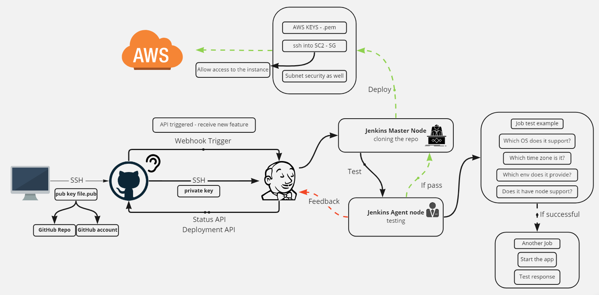

# Jenkins Guide
This guide will go through steps shown in this diagram.

- Keys generation guide [here](#keys-generation)
    - Set SSH keys on GitHub guide [here](#set-ssh-keys-on-github)
- Setting new job on Jenkins guide [here](#setting-new-job)

## Keys generation
We will generate a key pair used for connecting our local machine to GitHub and connecting to Jenkins from GitHub.  

1. We change directory to where we want the keys to be generated, e.g. `cd ~/.ssh`

2. Generate keys on windows by inputting the command `ssh-keygen -t rsa -b 4096 -C "<email address used for github>"`

### Set SSH keys on GitHub
This key is a public key for GitHub to identify the user that is accessing GitHub.  

1. We first navigate to our profiloe settings

2. Under Access, select SSH and GPG keys

3. Add new SSH key (this is the public key (.pub) we generated in [keys-generation](#keys-generation))

Official documentation available here: https://docs.github.com/en/authentication/connecting-to-github-with-ssh/generating-a-new-ssh-key-and-adding-it-to-the-ssh-agent  

## Setting new job

## Continuous Integration guide
